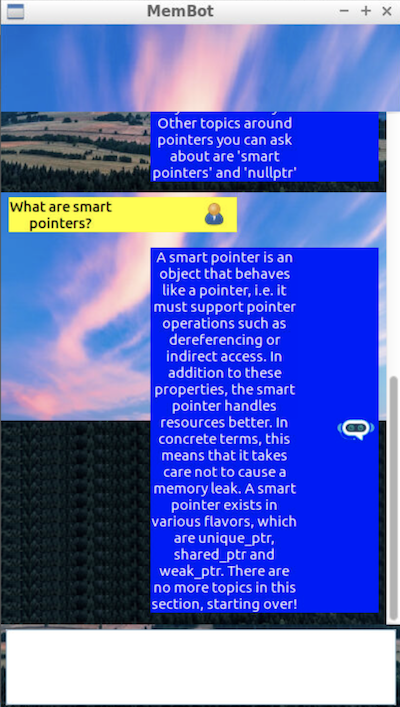
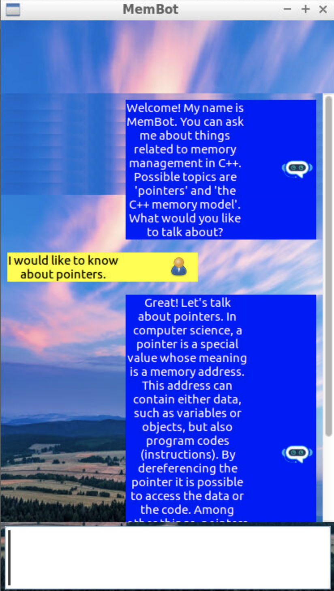

# Memory Management Chatbot

The ChatBot code creates a dialogue where users can ask questions about some aspects of memory management in C++. After the knowledge base of the chatbot has been loaded from a text file, a knowledge graph representation is created in computer memory, where chatbot answers represent the graph nodes and user queries represent the graph edges. After a user query has been sent to the chatbot, the Levenshtein distance is used to identify the most probable answer. The code is fully functional as-is and uses raw pointers to represent the knowledge graph and interconnections between objects throughout the project.

 

## Dependencies for Running Locally

* cmake >= 3.11
* make >= 4.1
* gcc/g++ >= 5.4
* wxWidgets >= 3.0

## Basic Build Instructions

1. Clone this repo.
2. Make a build directory in the top level directory: `mkdir build && cd build`
3. Compile: `cmake .. && make`
4. Run it: `./membot`.